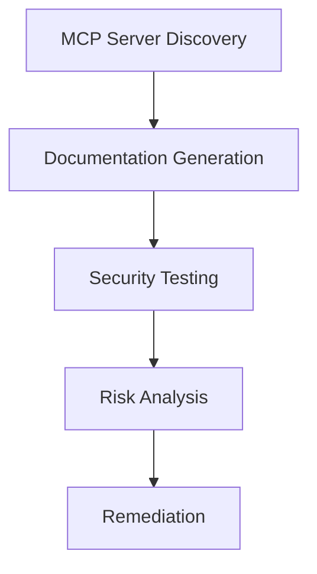

# Aran MCP Sentinel

Enterprise-Grade MCP (Model Context Protocol) Security and Management Platform

[](https://golang.org/)
[](https://nextjs.org/)
[](https://www.typescriptlang.org/)
[](https://supabase.com/)
[](https://opensource.org/licenses/MIT)
[](https://github.com/radhi1991/aran-mcp-sentinel/graphs/contributors)
[](https://github.com/radhi1991/aran-mcp-sentinel/issues)
[](https://github.com/radhi1991/aran-mcp-sentinel/pulls)



## Table of Contents
- [Key Features](#key-features)
- [Technology Stack](#technology-stack)
- [Documentation](#documentation)
- [Quick Start](#quick-start)
- [API Documentation](#api-documentation)
- [Configuration](#configuration)
- [Development](#development)
- [Contributing](#contributing)
- [Security Best Practices](#security-best-practices)
- [Roadmap](#roadmap)
- [Support](#support)
- [License](#license)

## Key Features

### 1. MCP Catalog / Discovery
- Automated discovery of MCP endpoints and services
- Comprehensive catalog of available MCP servers and tools
- Version tracking and compatibility management
- Service health monitoring and status reporting

### 2. MCP Documentation
- Interactive API documentation (similar to Swagger)
- Tool and endpoint specifications
- Usage examples and code snippets
- Versioned documentation history

### 3. MCP Secure Testing
- Comprehensive test suite for MCP implementations
- Automated security scanning
- Integration with CI/CD pipelines
- Test case management and reporting

### 4. MCP Security Analysis
- Real-time security monitoring
- Vulnerability assessment
- Compliance checking
- Risk scoring and prioritization

### 5. MCP Secure Deployment
- Secure configuration templates
- Deployment best practices
- Environment validation
- Rollback and recovery procedures

## Technology Stack

### Backend
- **Language**: Go 1.21+
- **Web Framework**: Gin
- **Database**: PostgreSQL (via Supabase)
- **Authentication**: JWT
- **Logging**: Zap
- **Configuration**: Viper
- **Testing**: Go Test
- **Containerization**: Docker

### Frontend
- **Framework**: Next.js 14 (App Router)
- **UI Library**: React 18 + TypeScript
- **Styling**: Tailwind CSS
- **State Management**: React Query
- **Form Handling**: React Hook Form + Zod
- **UI Components**: Radix UI + Custom Components
- **Charts**: Recharts
- **Icons**: Lucide React

### Infrastructure
- **Database**: Supabase (PostgreSQL)
- **Deployment**: Docker, Kubernetes
- **CI/CD**: GitHub Actions
- **Monitoring**: Prometheus, Grafana (Planned)

## Security Best Practices

### Supply Chain Security
MCP servers are composed of executable code, so users should only use MCP servers that they trust. Key considerations include:
- **Code Signing**: All MCP components must be signed by the developer for integrity verification
- **Build Pipeline Security**: Implement SAST (Static Application Security Testing) and SCA (Software Composition Analysis)
- **Dependency Management**: Regular scanning and updating of all dependencies
- **Cloud Service Verification**: Implement cryptographic server verification for cloud-hosted MCP servers

### Top 10 MCP Security Risks

1. **Prompt Injection**
   - **Risk**: Malicious inputs manipulating AI behavior
   - **Mitigation**: Implement input validation and monitoring

2. **Tool Poisoning**
   - **Risk**: Compromised tool metadata leading to malicious actions
   - **Mitigation**: Regular validation of tool metadata

3. **Privilege Abuse**
   - **Risk**: Excessive permissions leading to unauthorized access
   - **Mitigation**: Follow principle of least privilege

4. **Tool Shadowing**
   - **Risk**: Rogue tools mimicking legitimate services
   - **Mitigation**: Maintain a verified registry of trusted tools

5. **Indirect Prompt Injection**
   - **Risk**: Hidden malicious instructions in external data
   - **Mitigation**: Monitor and validate external content

6. **Sensitive Data Exposure**
   - **Risk**: Leakage of API keys and credentials
   - **Mitigation**: Secure credential storage and access controls

7. **Command/SQL Injection**
   - **Risk**: Unauthorized command execution
   - **Mitigation**: Input validation and parameterized queries

8. **Rug Pull Attacks**
   - **Risk**: Legitimate tools turning malicious
   - **Mitigation**: Behavior monitoring and sandboxing

9. **Denial of Wallet/Service**
   - **Risk**: Resource exhaustion leading to service disruption
   - **Mitigation**: Implement rate limiting and quotas

10. **Authentication Bypass**
    - **Risk**: Weak authentication mechanisms
    - **Mitigation**: Multi-factor authentication and regular audits

## Quick Start

### Prerequisites
- Go 1.21+ (for backend)
- Node.js 18+ (for frontend)
- Docker (optional, for containerized deployment)
- Supabase account (for database)

### Backend Setup

1. **Clone the repository**
   ```bash
   git clone https://github.com/radhi1991/aran-mcp-sentinel.git
   cd aran-mcp-sentinel
   ```

2. **Set up backend environment**
   ```bash
   cd backend
   cp configs/config.example.yaml configs/config.yaml
   # Update the configuration in configs/config.yaml
   ```

3. **Install Go dependencies**
   ```bash
   go mod download
   ```

4. **Start the backend server**
   ```bash
   go run cmd/server/main.go
   ```

5. **Verify the API is running**
   ```bash
   curl http://localhost:8080/health
   ```

### Frontend Setup

1. **Navigate to frontend directory**
   ```bash
   cd frontend
   ```

2. **Install Node.js dependencies**
   ```bash
   npm install
   ```

3. **Start the development server**
   ```bash
   npm run dev
   ```

4. **Open your browser**
   Navigate to [http://localhost:3000](http://localhost:3000)

### Docker Setup (Alternative)

1. **Build and run with Docker Compose**
   ```bash
   docker-compose up --build
   ```

2. **Access the application**
   - Frontend: [http://localhost:3000](http://localhost:3000)
   - Backend API: [http://localhost:8080](http://localhost:8080)

## API Documentation

For comprehensive API documentation, see [docs/API_DOCUMENTATION.md](docs/API_DOCUMENTATION.md).

### Quick API Reference

#### MCP Servers
- `GET /api/v1/mcp/servers` - List all MCP servers
- `GET /api/v1/mcp/servers/:id` - Get MCP server details
- `POST /api/v1/mcp/servers` - Add a new MCP server
- `GET /api/v1/mcp/servers/:id/status` - Get server status

#### Testing
- `POST /api/v1/mcp/tests` - Run a test against an MCP server
- `GET /api/v1/mcp/tests/:id` - Get test results

#### Health Check
- `GET /health` - Service health status

### Authentication
*Coming soon - JWT-based authentication planned*

## Architecture

### Core Components

1. **MCP Discovery**
   - Automated detection of MCP servers
   - Endpoint analysis
   - Service mapping

2. **Threat Detection**
   - Real-time traffic analysis
   - Anomaly detection
   - Pattern recognition

3. **Security Analysis**
   - Vulnerability assessment
   - Risk scoring
   - Compliance checks

## Configuration

### Environment Variables

Create a `.env.local` file in the root directory with the following variables:

```env
# API Configuration
NEXT_PUBLIC_API_URL=http://localhost:3000/api

# Authentication
NEXTAUTH_SECRET=your-secret-here
NEXTAUTH_URL=http://localhost:3000

# Logging
LOG_LEVEL=info

# Feature Flags
ENABLE_EXPERIMENTAL_FEATURES=false
```

## Development

### Project Structure
```
aran-mcp-sentinel/
├── backend/                 # Go backend application
│   ├── cmd/server/         # Main application entry point
│   ├── internal/           # Internal packages
│   ├── configs/            # Configuration files
│   └── go.mod              # Go module file
├── frontend/               # Next.js frontend application
│   ├── src/                # Source code
│   ├── public/             # Static assets
│   └── package.json        # Node.js dependencies
├── docs/                   # Documentation
├── deploy/                 # Deployment configurations
└── README.md              # This file
```

### Available Scripts

#### Backend (Go)
```bash
# Development
go run cmd/server/main.go

# Build
go build -o bin/mcp-sentinel cmd/server/main.go

# Test
go test ./...

# Lint
golangci-lint run
```

#### Frontend (Next.js)
```bash
# Development
npm run dev

# Build
npm run build

# Start production
npm start

# Lint
npm run lint

# Test
npm test
```

### Code Style

This project uses:
- **Backend**: Go modules, Go 1.21+ features, Gin framework
- **Frontend**: TypeScript, ESLint, Prettier, Tailwind CSS
- **Testing**: Go Test, Jest, React Testing Library
- **Documentation**: Markdown, JSDoc, API documentation

## Contributing

We welcome contributions from the community! Please see our [Contributing Guidelines](CONTRIBUTING.md) for details.

### Quick Start for Contributors

1. **Fork the repository**
2. **Choose an issue** from our [Issue List](docs/ISSUE_LIST.md)
3. **Create a feature branch** from `main`
4. **Make your changes** following our coding standards
5. **Write tests** for new functionality
6. **Submit a pull request**

### Good First Issues

Looking for a place to start? Check out our [Good First Issues](docs/ISSUE_LIST.md#good-first-issues-beginner-friendly) for beginner-friendly tasks.

### Development Setup

See the [Development](#development) section above for setup instructions.

## Roadmap

For detailed information about our development plans and upcoming features, see our [Roadmap](ROADMAP.md).

### Current Focus Areas
- **Phase 1**: Foundation & Core Features (Q1 2024)
- **Phase 2**: Security & Monitoring (Q2 2024)
- **Phase 3**: Advanced Features & Integration (Q3 2024)
- **Phase 4**: Enterprise & Scale (Q4 2024)

## Support

### Getting Help

- **Documentation**: [docs/](docs/) - Comprehensive documentation
- **API Reference**: [docs/API_DOCUMENTATION.md](docs/API_DOCUMENTATION.md) - Complete API documentation
- **Issues**: [GitHub Issues](https://github.com/radhi1991/aran-mcp-sentinel/issues) - Bug reports and feature requests
- **Discussions**: [GitHub Discussions](https://github.com/radhi1991/aran-mcp-sentinel/discussions) - Community discussions
- **Email**: support@aran-mcp-sentinel.com

### Community

- **Discord**: [Join our Discord server](https://discord.gg/aran-mcp-sentinel)
- **Twitter**: [@AranMcpSentinel](https://twitter.com/AranMcpSentinel)
- **Blog**: [Blog posts and updates](https://blog.aran-mcp-sentinel.com)

## License

This project is licensed under the MIT License - see the [LICENSE](LICENSE) file for details.

## Acknowledgments

- **MCP Protocol**: Built on the [Model Context Protocol](https://modelcontextprotocol.io/)
- **Open Source**: Thanks to all the open source projects that make this possible
- **Community**: Special thanks to our contributors and users
