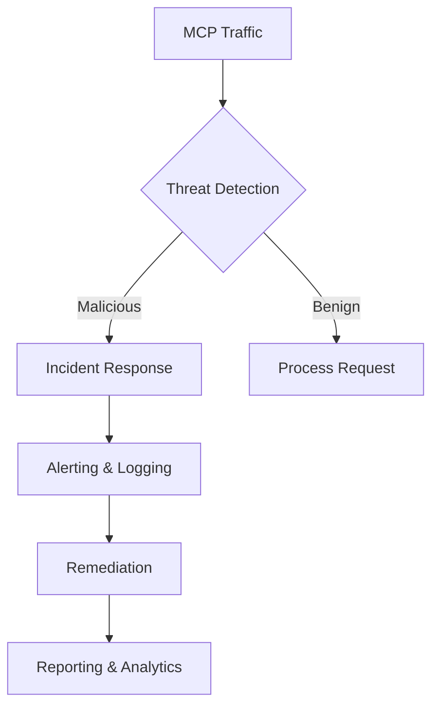

# Aran MCP Sentinel

Enterprise-Grade MCP (Model Context Protocol) Security Monitoring and Analysis Platform



## Table of Contents
- [Key Features](#key-features)
- [Technology Stack](#technology-stack)
- [Quick Start](#quick-start)
- [Architecture](#architecture)
- [Configuration](#configuration)
- [Development](#development)
- [License](#license)

## Key Features

### 🛡️ MCP Security & Protection
- **MCP Server Discovery**
  - Automated MCP endpoint discovery
  - Comprehensive MCP server catalog with versioning
  - Real-time MCP traffic monitoring

- **Threat Detection**
  - Advanced MCP-specific threat detection
  - Real-time monitoring and alerting
  - Automated incident response

- **Security Analysis**
  - In-depth MCP protocol analysis
  - Vulnerability scanning
  - Compliance reporting

## Technology Stack

- **Frontend**: Next.js 14, React 18, TypeScript
- **Styling**: Tailwind CSS
- **State Management**: React Context + Hooks
- **Validation**: Zod
- **Testing**: Jest, React Testing Library
- **Build Tool**: Vite

## Quick Start

1. **Clone the repository**
   ```bash
   git clone https://github.com/your-org/aran-mcp-sentinel.git
   cd aran-mcp-sentinel
   ```

2. **Install dependencies**
   ```bash
   npm install
   # or
   yarn
   # or
   pnpm install
   ```

3. **Set up environment variables**
   ```bash
   cp .env.example .env.local
   # Update the environment variables in .env.local
   ```

4. **Run the development server**
   ```bash
   npm run dev
   # or
   yarn dev
   # or
   pnpm dev
   ```

5. **Open [http://localhost:3000](http://localhost:3000) in your browser**

## Architecture

### Core Components

1. **MCP Discovery**
   - Automated detection of MCP servers
   - Endpoint analysis
   - Service mapping

2. **Threat Detection**
   - Real-time traffic analysis
   - Anomaly detection
   - Pattern recognition

3. **Security Analysis**
   - Vulnerability assessment
   - Risk scoring
   - Compliance checks

## Configuration

### Environment Variables

Create a `.env.local` file in the root directory with the following variables:

```env
# API Configuration
NEXT_PUBLIC_API_URL=http://localhost:3000/api

# Authentication
NEXTAUTH_SECRET=your-secret-here
NEXTAUTH_URL=http://localhost:3000

# Logging
LOG_LEVEL=info

# Feature Flags
ENABLE_EXPERIMENTAL_FEATURES=false
```

## Development

### Available Scripts

- `dev` - Start development server
- `build` - Build for production
- `start` - Start production server
- `lint` - Run ESLint
- `test` - Run tests
- `test:watch` - Run tests in watch mode
- `test:coverage` - Generate test coverage report

### Code Style

This project uses:
- ESLint for code linting
- Prettier for code formatting
- TypeScript for type safety

## License

This project is licensed under the MIT License - see the [LICENSE](LICENSE) file for details.
