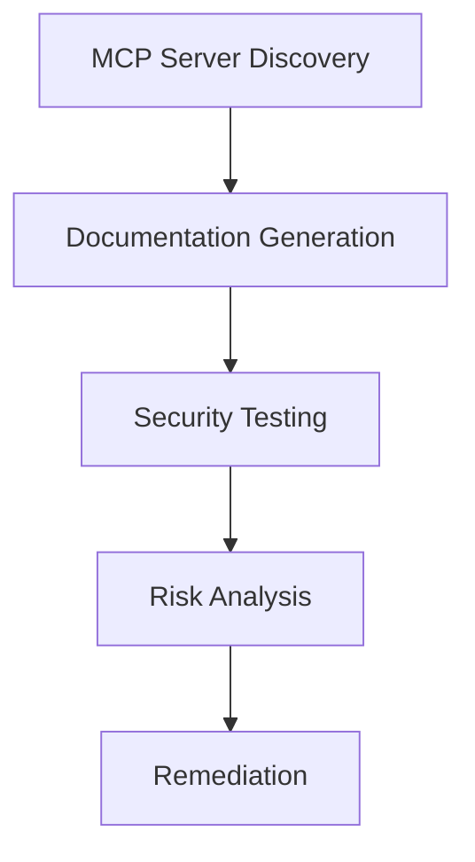

# Aran MCP Sentinel

Enterprise-Grade MCP (Model Context Protocol) Security and Management Platform

[](https://golang.org/)
[](https://supabase.com/)
[](https://opensource.org/licenses/MIT)



## Table of Contents
- [Key Features](#key-features)
- [Technology Stack](#technology-stack)
- [Quick Start](#quick-start)
- [API Documentation](#api-documentation)
- [Configuration](#configuration)
- [Development](#development)
- [Security Best Practices](#security-best-practices)
- [License](#license)

## Key Features

### 1. MCP Catalog / Discovery
- Automated discovery of MCP endpoints and services
- Comprehensive catalog of available MCP servers and tools
- Version tracking and compatibility management
- Service health monitoring and status reporting

### 2. MCP Documentation
- Interactive API documentation (similar to Swagger)
- Tool and endpoint specifications
- Usage examples and code snippets
- Versioned documentation history

### 3. MCP Secure Testing
- Comprehensive test suite for MCP implementations
- Automated security scanning
- Integration with CI/CD pipelines
- Test case management and reporting

### 4. MCP Security Analysis
- Real-time security monitoring
- Vulnerability assessment
- Compliance checking
- Risk scoring and prioritization

### 5. MCP Secure Deployment
- Secure configuration templates
- Deployment best practices
- Environment validation
- Rollback and recovery procedures

## Technology Stack

### Backend
- **Language**: Go 1.21+
- **Web Framework**: Gin
- **Database**: PostgreSQL (via Supabase)
- **Authentication**: JWT
- **Logging**: Zap
- **Configuration**: Viper
- **Testing**: Go Test
- **Containerization**: Docker

### Frontend (Planned)
- **Framework**: Next.js 14 (App Router)
- **UI Library**: React 18 + TypeScript
- **Styling**: Tailwind CSS
- **State Management**: React Query
- **Form Handling**: React Hook Form + Zod

### Infrastructure
- **Database**: Supabase (PostgreSQL)
- **Deployment**: Docker, Kubernetes
- **CI/CD**: GitHub Actions
- **Monitoring**: Prometheus, Grafana (Planned)

## Security Best Practices

### Supply Chain Security
MCP servers are composed of executable code, so users should only use MCP servers that they trust. Key considerations include:
- **Code Signing**: All MCP components must be signed by the developer for integrity verification
- **Build Pipeline Security**: Implement SAST (Static Application Security Testing) and SCA (Software Composition Analysis)
- **Dependency Management**: Regular scanning and updating of all dependencies
- **Cloud Service Verification**: Implement cryptographic server verification for cloud-hosted MCP servers

### Top 10 MCP Security Risks

1. **Prompt Injection**
   - **Risk**: Malicious inputs manipulating AI behavior
   - **Mitigation**: Implement input validation and monitoring

2. **Tool Poisoning**
   - **Risk**: Compromised tool metadata leading to malicious actions
   - **Mitigation**: Regular validation of tool metadata

3. **Privilege Abuse**
   - **Risk**: Excessive permissions leading to unauthorized access
   - **Mitigation**: Follow principle of least privilege

4. **Tool Shadowing**
   - **Risk**: Rogue tools mimicking legitimate services
   - **Mitigation**: Maintain a verified registry of trusted tools

5. **Indirect Prompt Injection**
   - **Risk**: Hidden malicious instructions in external data
   - **Mitigation**: Monitor and validate external content

6. **Sensitive Data Exposure**
   - **Risk**: Leakage of API keys and credentials
   - **Mitigation**: Secure credential storage and access controls

7. **Command/SQL Injection**
   - **Risk**: Unauthorized command execution
   - **Mitigation**: Input validation and parameterized queries

8. **Rug Pull Attacks**
   - **Risk**: Legitimate tools turning malicious
   - **Mitigation**: Behavior monitoring and sandboxing

9. **Denial of Wallet/Service**
   - **Risk**: Resource exhaustion leading to service disruption
   - **Mitigation**: Implement rate limiting and quotas

10. **Authentication Bypass**
    - **Risk**: Weak authentication mechanisms
    - **Mitigation**: Multi-factor authentication and regular audits

## Quick Start

1. **Clone the repository**
   ```bash
   git clone https://github.com/radhi1991/aran-mcp-sentinel.git
   cd aran-mcp-sentinel/backend
   ```

2. **Set up environment variables**
   ```bash
   cp .env.example .env
   # Update the environment variables in .env
   ```

3. **Install dependencies**
   ```bash
   go mod download
   ```

4. **Run database migrations**
   ```bash
   # TODO: Add migration commands once set up
   ```

5. **Start the development server**
   ```bash
   go run cmd/server/main.go
   ```

6. **Verify the API is running**
   ```bash
   curl http://localhost:8080/api/v1/health
   ```

## API Documentation

The following API endpoints are available:

### MCP Servers
- `GET /api/v1/mcp/servers` - List all MCP servers
- `GET /api/v1/mcp/servers/:id` - Get MCP server details
- `POST /api/v1/mcp/servers` - Add a new MCP server
- `GET /api/v1/mcp/servers/:id/status` - Get server status

### Testing
- `POST /api/v1/mcp/tests` - Run a test against an MCP server
- `GET /api/v1/mcp/tests/:id` - Get test results

### Authentication
*Coming soon*

## Architecture

### Core Components

1. **MCP Discovery**
   - Automated detection of MCP servers
   - Endpoint analysis
   - Service mapping

2. **Threat Detection**
   - Real-time traffic analysis
   - Anomaly detection
   - Pattern recognition

3. **Security Analysis**
   - Vulnerability assessment
   - Risk scoring
   - Compliance checks

## Configuration

### Environment Variables

Create a `.env.local` file in the root directory with the following variables:

```env
# API Configuration
NEXT_PUBLIC_API_URL=http://localhost:3000/api

# Authentication
NEXTAUTH_SECRET=your-secret-here
NEXTAUTH_URL=http://localhost:3000

# Logging
LOG_LEVEL=info

# Feature Flags
ENABLE_EXPERIMENTAL_FEATURES=false
```

## Development

### Available Scripts

- `dev` - Start development server
- `build` - Build for production
- `start` - Start production server
- `lint` - Run ESLint
- `test` - Run tests
- `test:watch` - Run tests in watch mode
- `test:coverage` - Generate test coverage report

### Code Style

This project uses:
- ESLint for code linting
- Prettier for code formatting
- TypeScript for type safety

## License

This project is licensed under the MIT License - see the [LICENSE](LICENSE) file for details.
